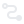

# O Projeto: GraphXperience
Este projeto tem como objetivo fornecer uma interface gráfica interativa para manipulação, personalização e execução de algoritmos em grafos. O usuário pode criar grafos personalizados, gerar grafos predefinidos, salvar/carregar grafos, aplicar alguns algoritmos já existentes ou até mesmo importar algoritmos personalizados e visualizar a execução dos algoritmos com animações dinâmicas.

# Acessando o GraphXperience
## Acesso público
É possível acessar o *GraphXperience* através de uma página criada como GitHub Pages: https://graphxperience.github.io.
<br/>
Recomenda-se a utilização do navegador [Google Chrome](https://www.google.com/intl/pt-BR/chrome/).

## Instalação e Configuração Local
Caso prefira rodar o código na própria máquina para depurar ou alterar o código, basta cloná-lo e executá-lo com *Node*.
Primeiro, certifique-se que você tem o *Node* instalado na versão mais estável (LTS) e o *Git*.
- Link para baixar o Node: https://nodejs.org/pt/download/package-manager
- Link para baixar o Git: https://git-scm.com/downloads

Em seguida, siga os passos:
1. Clone o repositório:
```bash
git clone https://github.com/graphxperience/graphxperience.github.io.git
```
2. Selecione a branch mais atualizada e atualize-a:
```bash
git checkout main
git pull origin main
```
3. Instale as dependências
```bash
npm install
```
4. Execute o projeto
```bash
npm run start
```
# Teclas de atalho
- **Enter**: Confirma ações de modais abertos.
- **Esc**: Fecha modais.
- **Ctrl + A**: Seleciona todos os elementos do grafo.
- **Ctrl + C**: Copia os elementos selecionados.
- **Ctrl + V**: Cola os elementos copiados.
- **Ctrl + Z**: Desfaz a última ação.
- **Ctrl + Y**: Refaz a última ação.
- **E**: Entra no modo desenho, onde é possível clicar e arrastar de um nó para o outro para criar uma nova aresta.
- **N**: Adiciona um novo nó no local do cursor do mouse.
- **S**: Conecta os nós selecionados.
- **D**: Desconecta os nós selecionados.
- **Del**: Remove os elementos selecionados.
- **Botão direito do mouse**: Abre um menu circular nos elementos selecionados para personalizá-los
- **Botão esquerdo do mouse**: Seleciona um elemento (OBS: segurar o botão esquerdo abre um "menu circular" para editar diferentes propriedades do elemento)

# Funcionalidades Principais
Este projeto permite que o usuário:
- Crie grafos personalizados
- Gere grafos predefinidos a partir de inputs
- Personalize os nós e arestas, alterando suas cores, tamanhos, pesos e tags
- Execute algoritmos já existentes, como busca em profundidade (DFS), detecção de ciclos, caminho mínimo entre dois nós etc.
- Importe e execute algoritmos customizados
- Exporte os grafos como JSON, PNG ou JPEG
- Carregue grafos em formato JSON
- Visualize a animação dinâmica dos algoritmos durante sua execução, controlando a velocidade, pausando ou até mesmo retrocedendo.

## Menu Superior
O menu superior oferece várias opções para manipular o grafo, de maneira parecida com o que pode ser feito pelo teclado. Aqui estão os botões disponíveis:
- **Adicionar Nós** : Adiciona um nó na posição do cursor.
- **Remover Elementos Selecionados** : Remove os elementos selecionados.
- **Conectar Nós Selecionados** : Conecta nós selecionados.
- **Desconectar Nós Selecionados** : Remove as arestas conectadas aos nós selecionados.
- **Modo Desenho** : Ativa o "modo desenho", facilitando a criação de arestas
- **Limpar Grafo** : Remove todos os elementos do grafo.
- **Adicionar Tag nos Nós** : Adiciona tags de 0 a "n-1" para os "n" vértices do grafo.
- **Upload do Grafo por Arquivo JSON** : Importa um grafo em formato JSON.
- **Download do Grafo** : Exporta o grafo atual (nos formatos JSON, JPEG ou PNG).
- **Editor de Configurações Globais** : Abre um editor para customizar as configurações globais do grafo.
- **GitHub** : Ícone que leva à página oficial do projeto no GitHub, onde é possível visualizar essa documentação.
- **Informações Gerais** : Acessa informações sobre a interface, como as dicas de teclas de atalho

## Menu Lateral da Esquerda
O menu lateral da esquerda inicialmente está escondido, mas pode ser aberto ao clicar no "botão hamburguer" (com as três linhas horizontais paralelas). Nele, é possível acessar:
- **Testar Algoritmo**: Aqui o usuário pode executar algoritmos predefinidos já implementados (ex: BFS, DFS, checar ciclos, obter componentes conexas, obter componentes fortemente-conexas, obter caminho mínimo entre dois nós). Há botões informativos ao lado de cada algoritmo para explicar como ele funciona e sua complexidade de tempo-espaço (Big O).
- **Criar Grafo Predefinido**: Aqui o usuário pode criar grafos predefinidos a partir de algum input, como grafo regular, grafo completo, grafo estrela, grafo roda, grafo bipartido, grafo bipartido completo, grafo árvore binária, grafo de Pertersen.
O input pode ser, por exemplo, o número "n" de nós: varia conforme o grafo predefinido. Há um botão de informação para cada tipo de grafo explicando sua definição.
- **Algoritmos Personalizados**: Aqui o usuário pode *limpar* algoritmos já carregados ou *adicionar algoritmo* direto do diretório local. Há um botão de informação explicando
como deve ser o arquivo importado.

## Algoritmos Predefinidos
Existem algoritmos predefinidos já disponíveis. É possível abrir as informações do algoritmo através do ícone  ou acessar a página do arquivo .js desse algoritmo no botão . Os algoritmos disponíveis são:
- **Busca em Largura (BFS)**: Explora o grafo começando de um nó raiz e se expandindo para os vizinhos.
- **Busca em Profundidade (DFS)**: Explora o grafo de maneira recursiva, descendo profundamente pelos caminhos do grafo e voltando em backtracking.
- **Checar ciclos**: Verifica se o grafo contém ciclos.
- **Obter componentes conexas**: Identifica as diferentes componentes conectadas do grafo.
- **Obter componentes fortemente-conexas**: Encontra os subconjuntos de nós em que cada nó é acessível a partir de todos os outros.
- **Obter caminho mais curto entre dois nós**: Encontra o caminho mais curto entre dois nós selecionados usando o algoritmo de Dijkstra.

## Animações
Esta aplicação permite visualizar a execução dos algoritmos através de *animações*, que são
são configuráveis em tempo real através da barra que aparece no centro inferior da tela.

O usuário pode ajustar a velocidade da animação, pausar, avançar 1 passo, retroceder 1 passo,
pular para o início ou pular para o final. Ao importar algoritmos customizados, é possível
controlar o que será passado nas animações.

Durante a execução da animação, um novo botão surge no canto superior direiro da tela, abaixo do menu superior. Esse botão é um "hamburguer button" que permite expandir uma janela de console. Ao importar algoritmos customizados, é possível controlar o que será escrito na janela de console.

## Algoritmos Personalizados
É possível importar algoritmos customizados para o projeto. Para adicionar um novo algoritmo:
1. Abra o menu lateral à esquerda, clicando no "botão hamburguer" 
2. Role a barra de rolagem para baixo até chegar na seção *Algoritmos Personalizados*
3. Clique em *Adicionar Algoritmo*
4. Selecione o arquivo com extensão .js presente em seu diretório local.
> Além da extensão precisar ser .js, é importante que a função principal se chame *customAlgorithm*. Ela pode conter os parâmetros *graph* e *selectedNodes*, onde *graph* é uma instância da classe *Graph* e *selectedNodes* é uma lista de *Node* selecionado.
5. Após selecionar um arquivo válido, abrirá um modal de *Detalhes do Algoritmo*.
Digite obrigatoriamente um nome e opcionalmente uma descrição e então clique em *Ok*.
> Caso já exista um algoritmo de mesmo nome, será aberto um modal de confirmação se o usuário deseja substituir o algoritmo existente pelo novo. Clique em *Sim* se quiser, ou em *Não* para voltar ao modal de *Detalhes do Algoritmo*.

Algoritmos importados passam a fazer parte da lista de algoritmos na seção de *Algoritmos Personalizados*.
Você pode:
- *Ver informações*, clicando no 
- *Editar*, clicando no  
- *Deletar*, clicando no 
- *Baixar*, clicando no 

Caso queira limpar todos os algoritmos customizados, utilize o botão *Limpar Algoritmos Customizados*

## Personalização dos Grafos
A interface permite diversas personalizações nos vértices e arestas do grafo, fora configurações globais
para o grafo todo, como:
- **Cores**: as cores dos nós e arestas podem ser individualmente alterados ou globalmente alterados com o *editor de configuração global* 
- **Pesos**: os grafos por padrão não tem peso, mas caso um nó tenha seu peso alterado, os nós passam a mostrar seu peso (lembrando que por padrão todos tem peso 1). O mesmo vale para as arestas. Você pode desabilitar o peso (setando todos para 1 e desabilitando a visualização dos pesos) através do *editor de configuração global* 
- **Tags**: as tags servem para setar um *label* aos nós e arestas, facilitando na visualização de algoritmos.
- **Dimensões/Espessuras**: os nós e arestas podem ter suas dimensões alteradas. Os valores são sempre de 1 a 10, onde 10 é o tamanho máximo e 1 é o tamanho mínimo. No caso de arestas, a dimensão está relacionada à espessura da aresta. No caso de nós, a dimensão está relacionada ao diâmetro do nó.

## Editor de Configuração Global
Representando pelo símbolo , abre um modal que permite editar configurações globais da interface, servindo tanto para os elementos existentes quanto para os elementos novos que forem criados. As opções ficam salvas em um armazenamento temporário local (localStorage), mas podem ser resetadas no botão *Resetar aplicação*. Segue a descrição das opções:
- **Cor dos nós**: altera a cor global dos nós.
- **Cor das arestas**: altera a cor global das arestas.
- **Cor das tags**: altera a cor global da tags, caso algum elemento a possua. A cor será aplicada tanto para tags de nós quanto para tags de arestas.
- **Tamanho do nó (1-10)**: altera o tamanho global dos nós em uma escala de 1 a 10 (diâmetro)
- **Tamanho da aresta (1-10)**: altera o tamanho global das arestas em uma escala de 1 a 10 (espessura)
- **Grafo direcionado?**: quando marcado, torna o grafo direcionado.
- **Peso nos nós?**: quando marcado, mostra um "label" de peso para todos os nós (por padrão, o peso é 1). Quando desmarcado, os nós tem todos os seus pesos resetados para 1 e esse "label" fica oculto.
- **Peso nas arestas?**: quando marcado, mostra um "label" de peso para todas as arestas (por padrão, o peso é 1). Quando desmarcado, as arestas tem todos os seus pesos resetados para 1 e esse "label" fica oculto.
- **Resetar aplicação** : botão que limpa o armazenamento local de configuração global - resetando as opções para o *padrão* - e remove todos os algoritmos customizados importados. A configuração global padrão é: cor dos nós cinza `#808080`, cor das arestas cinza `#808080`, cor das tags azul `#04364A`, tamanho dos nós *4*, tamanho das arestas *4*, grafo direcionado, sem peso nos nós, sem peso nas arestas.

Não se esqueça de clicar em *Ok* para salvar as alterações ou em *Cancelar* para desfazer as alterações.

## Importação e Exportação dos Grafos
O projeto permite que o usuário importe grafos em formato JSON para visualização e manipulação.
Da mesma forma, os grafos criados podem ser exportados tanto em formato JSON quanto em imagem (JPEG/PNG).
- **Carregar grafo JSON**: Clique no botão *Carregar grafo* e selecione e o arquivo JSON.
- **Salvar Grafo JSON**: Coloque o mouse sobre o botão *Salvar grafo* e clique na opção *JSON* para exportar o grafo atual em formato JSON
- **Salvar Grafo como Imagem**: Coloque o mouse sobre o botão *Salvar grafo* e clique ou na opção *JPEG* ou na opção *PNG* para salvar o grafo como uma imagem

# Algoritmos Customizados
Os algoritmos customizados foram criados para permitir que usuários implementem lógicas específicas sobre o grafo visualizado, oferecendo uma maneira flexível de realizar operações e análises diretamente na estrutura do grafo. Com eles, você pode desenvolver desde buscas personalizadas até cálculos complexos sobre as propriedades de nós e arestas.

Esses algoritmos operam sobre uma estrutura de `Graph`, uma classe `facade` que organiza os elementos do grafo (nós e arestas) de maneira acessível e eficiente. Essa estrutura facilita a manipulação e a consulta dos elementos do grafo, permitindo o desenvolvimento de algoritmos adaptados às necessidades específicas do usuário.

## Estrutura do Arquivo `customAlgorithm.js`
Para garantir a integração do algoritmo customizado com o sistema, o arquivo que contém o código do algoritmo deve seguir uma estrutura padrão. A principal exigência é que o arquivo defina uma função chamada `customAlgorithm`, que será a função principal executada. Outras funções auxiliares podem ser incluídas, mas `customAlgorithm()` deve ser o ponto de entrada.

## Parâmetros da Função `customAlgorithm`
- `graph`: Uma instância da classe `Graph`, que encapsula os nós (`Node`) e arestas (`Edge`) do grafo e oferece métodos para manipulação e consulta.
- `selectedNodes`: Um array de nós que foram selecionados pelo usuário no grafo, passados como instâncias de `Node`. Esse parâmetro é especialmente útil para algoritmos que precisam de um conjunto inicial de nós para operações, como buscas.

## Exemplo de Estrutura do Arquivo
```javascript
// customAlgorithm.js

function customAlgorithm(graph, selectedNodes) {
    // Código principal do algoritmo, utilizando os métodos de `Graph`.
    // Exemplo de interação: buscar vizinhos, obter arestas, etc.
}

// Outras funções auxiliares (opcionais)
function helperFunction() {
    // Implementação de funções de apoio, caso necessário.
}
```

## Classe `Graph`
A classe `Graph` representa o grafo como um todo, agrupando os nós e arestas e fornecendo métodos para consulta e navegação.

### Atributos
- `nodes`: Array de instâncias de `Node`, representando todos os nós do grafo.
- `edges`: Array de instâncias de `Edge`, representando todas as arestas do grafo.
- `isDirected`: Booleano que indica se o grafo é direcionado ou não.

### Métodos
- `getEdges(node)`: Retorna um array com todas as arestas conectadas ao nó especificado.
- `getEdge(sourceNode, targetNode)`: Retorna a aresta entre dois nós específicos, se existir.
- `getNeighbors(node)`: Retorna um array de nós vizinhos ao nó especificado. Se o grafo for não direcionado, inclui também os vizinhos de entrada.

## Classe `Node`
A classe `Node` representa um nó individual do grafo, contendo seus atributos e referências para as arestas de entrada e saída.

### Atributos
- `id`: Identificador único do nó.
- `weight`: Peso do nó, que pode ser usado em cálculos e algoritmos.
- `tag`: Tag/label para categorizar ou identificar o nó
- `outgoingEdges`: Array de arestas que saem do nó (referências de instâncias de `Edge`).
- `incomingEdges`: Array de arestas que chegam ao nó (referências de instâncias de `Edge`).

### Métodos
- `addOutgoingEdge(edge)`: Adiciona uma aresta de saída ao nó.
- `addIncomingEdge(edge)`: Adiciona uma aresta de entrada ao nó.

## Classe `Edge`
A classe `Edge` representa uma aresta entre dois nós, podendo ter peso e uma tag associada.

### Atributos
- `id`: Identificador único da aresta.
- `sourceNode`: Referência ao nó de origem (instância de `Node`).
- `targetNode`: Referência ao nó de destino (instância de `Node`).
- `weight`: Peso da aresta, que pode ser usado em cálculos e algoritmos.
- `tag`: Tag/label para categorizar ou identificar a aresta.

# Contribuições
Contribuições são bem-vindas! Sinta-se à vontade para enviar pull requests com melhorias e sugestões. Elas podem ser aprovadas por nós: [Lucas Formaggine](https://github.com/lucasformaggine) e [Pedro Lucas](https://github.com/pancine).


